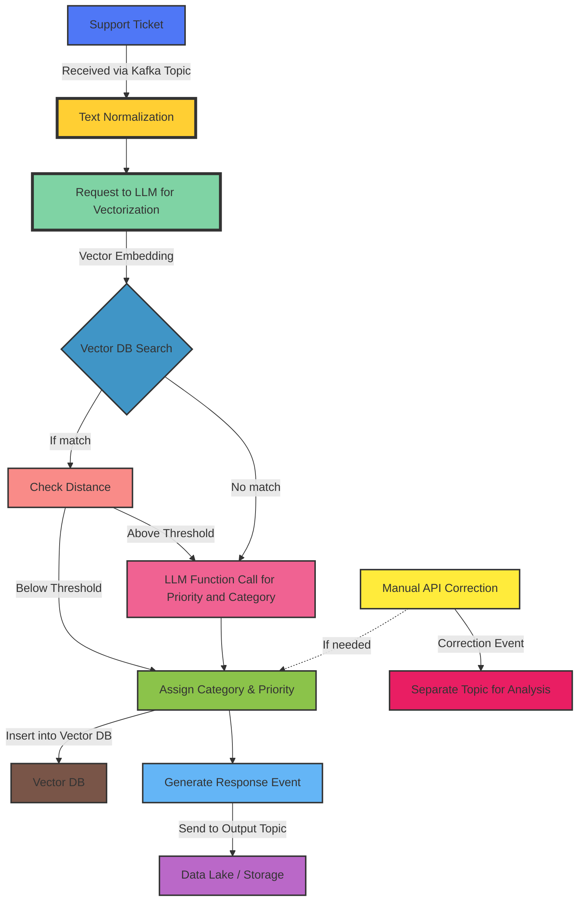

# PAC

PAC is a tool for Prioritization and Categorization of support tickets. It enables quick and effortless categorization of support tickets for any kind of product. The main goal of a project is to remove manual human labor and automate the process. It reaches the goal using Vector Semantic Search and LLM function calling.

Quick explanation of the logic behind it is as follows: support ticket data is received by PAC using Kafka topic. PAC first vectorizes ticket data and searches similar vectors in Vector DB using COSINE similarity. In the resulting search result list it takes the most similar and checks the distance between what's given and most similar vector from Vector DB, if the distance is greater than some specific threshold, then the received ticket will be assigned the same category and priority. If the search and threshold check failed, then request to LLM is made, which should return category and priority for the ticket. After the ticket is assigned with priority and category it is inserted into Vector DB. The same process is applied for all the other incoming tickets. This approach saves up costs for LLM requests by first checking the Vector DB and if there is no similar enough ticket, only then it makes the request.

PAC also generates a response event with original ticket data and priority and category and sends it to output topic. So that this event can be further sent to data lake or other storage for later BI or other type of analysis.

In case if priority or category of a certain ticket was assigned incorrectly, there is an API so that correct priority or category can be assigned manually. If such case happens, app sends separate correction event to a separate topic, so that it will be taken to account during analysis.

### Process Flow

### Tech Stack
- Python 3.10
- Milvus
- Kafka and Zookeeper
- Docker
- OpenAI

### Components
1. Text Normalizer
    - Removes Noise: Strips out irrelevant characters.
    - Standardizes: Converts all characters to lowercase to ensure consistency.
    - Anonymizes: Replaces names, email adresses, phone numbers, and any other user-specific data with generic placeholders.
    - Normalizes URLs and Paths: Converts URLs, file paths, or specific codes to generic placeholders or remove them if they are not relevant to the understanding of the ticket.

2. Vectorizer: creates a vector embedding from given text.

3. Vector DB Repository
    - Searches Similar Tickets
    - Inserts into Vector DB
    - Updates Record in Vector DB
    - Removes Record from Vector DB
    - Gets a Record by ID from Vector DB

4. PAC: given a ticket prioritizes and categorizes it to be one of available categories.

5. Updater: corrects already PACed ticket with given priority and category.
